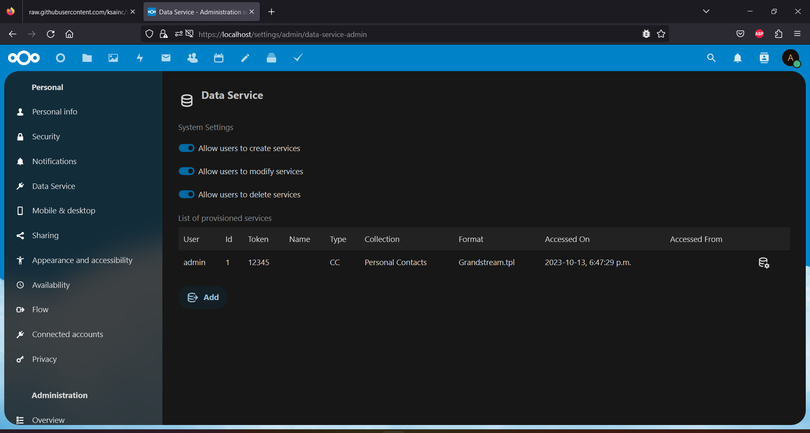
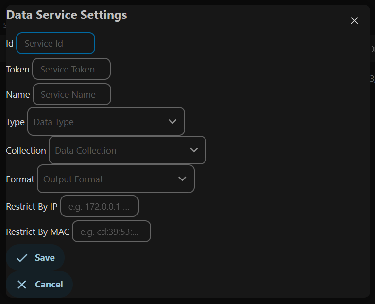

# Data In/Out Service for Nextcloud

Data Service for Nextcloud, is an app that can be used to retrieve Contacts, Calendar and Tasks data in formats other then WedDAV or RestAPI.

The app supports retrievel of data in JSON, XML, CVS and other formats.

The original purpose/idea behind the app was to supply contacts data to devices like SIP phones, but the app can also be used to feed data to other devices and services that do not speak WebDAV.

The app supports simplified token authentication, IP, MAC and Agent restrictions

## How to use

First step is to install the app from the app store.

Once the app is installed, navigate to "Data Services" under either the Admin or Personal section.

Click add, and fill in the required settings.

Settings:
* Service Id - Required - Must be unique for every service
* Service Token - Required - No restrictions
* service Name - Optional
* Data Type - Required - Select either Contacts, Calendar or Tasks
* Data Collection - Required - Select a users Address book or Events or Tasks Calendar
* Format - Required - Output format (e.g for a Grandstream SIP Phone select Grandstream)
* Restrict By IP - Optional - Limit the service to requests from a specific remote IP address or CIDR network
* Restrict By MAC - Optional - Limit the service to requests with a specific MAC address. (Used for SIP phones)
* Restrict By UA - Optional - Limit the service to requests with a specific UserAgent string

After a service has been added use one of the following formats in your device / service.

The following examples use the following information, these would need to be replaced by your values.

* Nextcloud Location - https://nextcloud-domain-or-ip
* Service ID - a898
* Service Token - e0e1dd54b9d2489097afb201d6457bee

#### JSON - For General Use

This outputs data in fully structured JSON format. Including contact pictures and calendar attachments. 

https://nextcloud-domain-or-ip/apps/dido/json/a898/?token=e0e1dd54b9d2489097afb201d6457bee

#### XML - For General Use

This outputs data in fully structured XML format. Including contact pictures and calendar attachments. 

https://nextcloud-domain-or-ip/apps/dido/xml/a898/?token=e0e1dd54b9d2489097afb201d6457bee

#### CVS - For General Use

This outputs data in structured CSV format. The CSV output does not include contact pictures or calendar attachments and uses custom formatting for array fields like phone numbers and addresses.

https://nextcloud-domain-or-ip/apps/dido/csv/a898/?token=e0e1dd54b9d2489097afb201d6457bee

#### Grandstream - For use with Grandstream SIP Phones

Grandstream SIP phones require specific a URL and formating which is generated live by the app.

Use the following URL in the "Phonebook Management" section of your Grandstream SIP phone.

https://nextcloud-domain-or-ip/apps/dido/grandstream/a898/e0e1dd54b9d2489097afb201d6457bee

#### Snom - For use with Snom SIP Phones

Snom SIP phones require specific formating which is generated live by the app.

Use the following URL in the provisioning file of your SIP phone.

https://nextcloud-domain-or-ip/apps/dido/phone/a898/?token=e0e1dd54b9d2489097afb201d6457bee

#### Yealink - For use with Yealink SIP Phones

Yealink SIP phones require specifi formating which is generated live by the app.

Use the following URL in the "Remote Phone Book" section of your Yealink SIP phone.

https://nextcloud-domain-or-ip/apps/dido/phone/a898/?token=e0e1dd54b9d2489097afb201d6457bee

## Requirements

This app has some minimal requirements.

- [Nextcloud](https://nextcloud.com/) instance (≥ 26.0.0)
- PHP  (≥ 7.4.0)

## Installation

Search for "Data Service" in your apps manager, click download then enable.

Configure the application in the administrator or personal settings section, under Data Service.

## Features

The following is a list of supported features,

* Administrative configuration of services for users

* Administrative lock out of functionallity for users

* User configuration of services for own use

* Supported security features
    * Id/Token Authentication
    * IPv4 and IPv6 address restriction
    * MAC address restriction
    * User Agent restriction

* Supported Data Formats
    * JSON
    * XML
    * CSV
    * Custom (Template Based Formats)

* Supported SIP Devices (Currently Available Templates)
    * Grandstream
    * Snom
    * Yealink
    * Zoiper

## Future Features
- Nothing at the moment (Suggestions are welcome)
